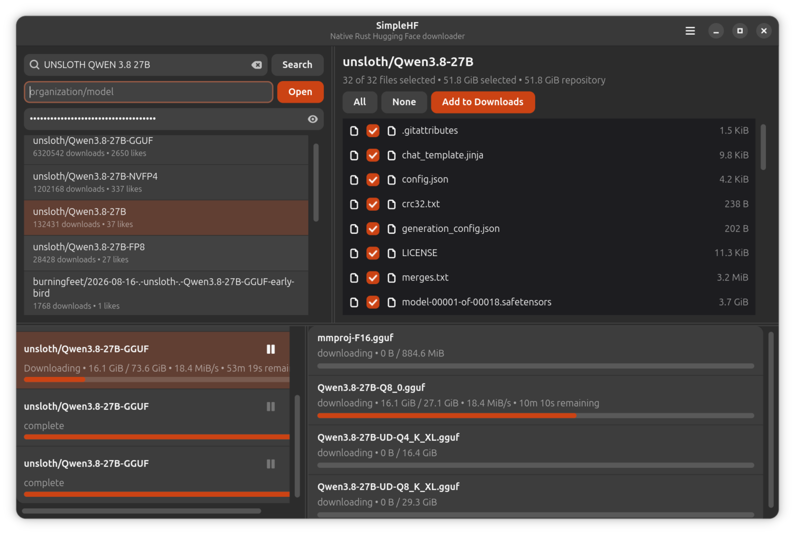

# SimpleHF



SimpleHF is a native Linux app for browsing Hugging Face repositories, selecting only the files you need, and downloading them with pause/resume, progress, speed, and ETA. It preserves repository folders and supports access tokens for gated or private models.

## Install on Debian 13+ or Ubuntu 24.04/26.04+

For the first Open Research Tools installation on a system, copy and run this command:

```sh
wget -qO /tmp/keyring.deb https://keyring.openresearchtools.com && sudo apt install -y /tmp/keyring.deb && sudo apt update && sudo apt install -y simplehf
```

If the Open Research Tools APT repository is already configured:

```sh
sudo apt install simplehf
```

## Credits

SimpleHF's download architecture is derived from Johannes Bertens' MIT-licensed [rust-hf-downloader](https://github.com/JohannesBertens/rust-hf-downloader).
